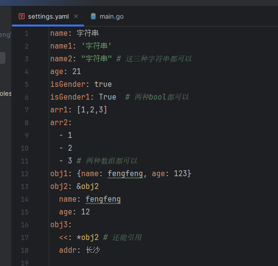

## 项目创建
- 设置go env proxy: 北美直接用就好；国内 `https://goproxy.cn`

## 配置文件
- 程序中，一些不经常变化的值，我们会把它存放到配置文件中
- 比如 `数据库的地址`、`用户名密码`，`jwt的过期时间`，`文件上传的路径`等等
- 如果不用配置文件，假如你想改某一项配置，那么你的程序就得重新编译
- 配置文件使用的是`yaml`文件
- 用`toml`，`ini`，`json`也可以，只需要用go去解析对应的文件就行
- 但是`yaml`要灵活一点，而且用起来简单，可以写注释

### yaml语法
   
- 冒号和后面的值之间是用空格的

### 解析yaml文件
- 使用的库是 `gopkg.in/yaml.v3`
- 平时可以区分开发环境`settings_dev.yaml`和其他环境`settings.yaml`
