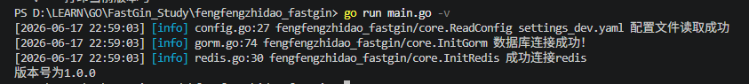
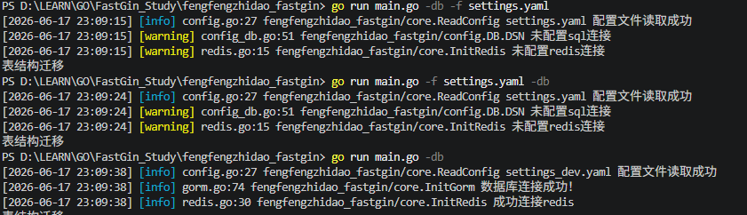

# 命令行操作部分
- 通过flag内置库实现命令行参数绑定
- 可以通过 `go run main.go -h` 看到所有绑定的参数

#### 命令行里的自定参数
- 先在 `flags.parse()`里定义每个参数意义
- 用结构体存储参数定义和值
```Go
// 创建一个结构体保存从命令行里传入的值
type FlagOptions struct {
	File    string // 配置文件
	Version bool   // 版本号
	DB      bool   // 表结构
}
```
- 用公共参数，使得外部可以查看调用命令行里的值
```Go
// 用public参数，这样main和config都可以获取
var Options FlagOptions
```
- 先定义参数，后决定参数出现时该做什么
```Go
func Parse() {
	// param1: 传入的参数变量映射到此处
	// param2：自定义的标识 -f
	// param3：如果不传入的默认值
	flag.StringVar(&Options.File, "f", "settings_dev.yaml", "config file path")
	flag.BoolVar(&Options.Version, "v", false, "打印当前版本号")
	flag.BoolVar(&Options.DB, "db", false, "迁移表结构")

	flag.Parse()
	// fmt.Println(Options.File)
}

func Run() (ok bool) {
	if Options.DB {
		fmt.Println("表结构迁移")
		return true
	}

	if Options.Version {
		fmt.Printf("版本号为%s", global.Version)
		return true
	}

	return false

}

```
- 当命令行出现某些参数，直接返回用户想要信息，不用继续往下走
    - ```Go
        // in main
        if flags.Run() {
            return
        }

      ```
    - 
    - 顺序不影响读取 `-f config文件` 
    - 


# 表结构迁移
1. 创建表结构
    - `models/users_model`
2. 用`gorm.AutoMigrate`迁移表结构
    - `flags/db.go`
    - ```GO
        // 迁移表
        func MigrateDB() {
            err := global.DB.AutoMigrate(&models.UserModel{})
            if err != nil {
                logrus.Errorf("表结构迁移失败 %s", err)
                return
            }

            logrus.Infof("表结构迁移成功")
        }
      ```

# 命令行创建用户
- 格式
    - `go run main.go -t user -s create/remove/list/...`