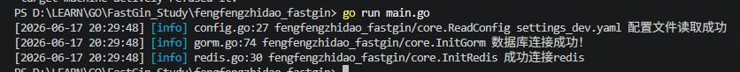

# 数据库连接
- 支持三种数据库，四种连接方式
    1. mysql
    2. pgsql
    3. sqlite
    4. 不连，用内存

### redis连接
- 用wsl下载docker
    - `https://daniel.es/blog/how-to-install-docker-in-wsl-without-docker-desktop/`
- 用docker下载redis镜像
    - `docker pull redis`
- 创建redis-server容器
    - `docker run -d --name redis-server -p 6379:6379 redis`
    - `docker run`: 创建并运行容器
    - `-d`: 后台运行（detached）
    - `--name redis-server`: 容器名称
    - `-p 6379:6379`: 端口映射
        - 左：windows主机端口
        - 右：redis容器端口
    - `redis`: 使用的镜像名称
- 查看是否成功启动
    - `docker ps`：查看已经启动的容器
    - `docker ps -a`: 查看所有容器，包括未启动容器
- 进入Redis命令行
    - `docker exec -it redis-server redis-cli`
    - `exec`: 在已经运行的容器里执行一个命令
    - `-i`：--interactive 保持标准输入打开：允许输入
    - `-t`：--tty 分配一个终端，让docker给一个像linux终端一样的界面
    - `ping`：回应`PONG` - 说明运行正常
- 关闭容器
    - `docker stop redis-server`
- 关闭后重新启动`redis-server`容器
    - `docker start redis-server`
- 删除容器（先关闭后删除
    - `docker rm redis-server`
- 删除镜像
    - `docker rmi redis`

- 