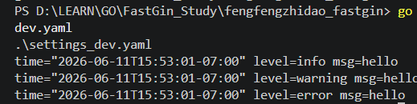
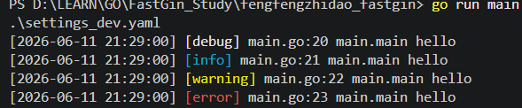

# 日志配置
- 日志这是一件非常重要的东西，非常建议大家在写项目的时候多打日志
- 因为我们开发项目的时候，肯定多多少少会有问题，这很正常
- 重点是，能不能通过日志就能发现问题出在哪里
- 而不是根据问题去看代码然后去分析原因
- 然后这个地方也牵扯到了后端报错要不要返回给前端的问题
- 这种情况得分类讨论，如果是公司内部使用的话，就把错误直接返回就行了，这样以后遇到错误能马上知道错误的原因，然后改掉
- 但是如果是外部使用，直接返回后端的错误，显得你们这个产品没有水平，统一封装一下，比如网络错误，系统错误，然后在日志里面把具体错误显示出来
- 日志的选择，使用的是`logrus`，当然你也可以选择`zap`


#### logurs日志
- `go get github.com/sirupsen/logrus`
- 默认日志
    ```Go
        logrus.Debugf("hello")
        logrus.Infof("hello")
        logrus.Warnf("hello")
        logrus.Errorf("hello")
    ```
    - 运行结果：
- 一般来说，日志打印的时候，要能够知道是那个地方打印的，以及打印的时间
- 还有一些升级功能，比如日志分片，按时间分，按大小分，按日志级别分等  
   
1. 配置格式化：
    - 需要实现`Format(entry *logrus.Entry) ([]byte, error)` 方法
    - 具体看 `core/logrus.go`
    - 设置完成后`main`里调用 `initlogger`
    - 
2. 配置hook:
    - 需要实现产生日志之后，把它写入到日志文件中去
    - 按天分片
    - 错误的日志单独存放

